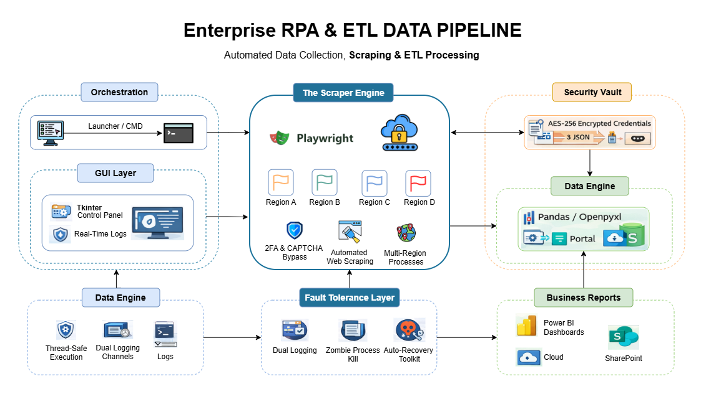
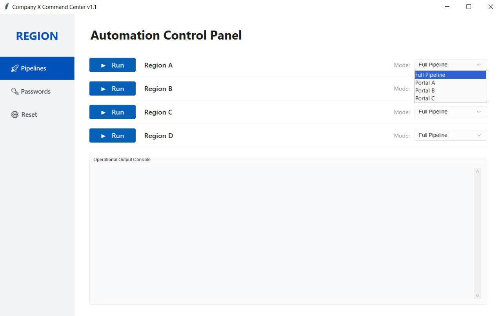
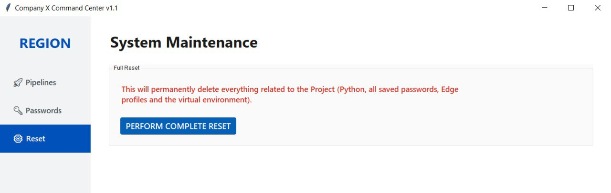
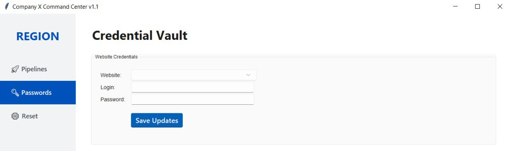

# 🌍 Enterprise Data Ingestion & Automation Pipeline

> ⚠️ **NDA Notice:** This repository contains a portfolio-safe, anonymized version of a production automation system originally developed for a global enterprise environment. All portal names, credentials, endpoints, and proprietary business logic have been fully anonymized.

---

## 🚀 Project Overview

This project demonstrates a real-world **data ingestion and ETL pipeline** that automatically collects operational data from multiple highly secure enterprise web portals and transforms it into clean, structured datasets for analytics workflows.

The system bridges the gap between legacy web infrastructure and modern BI tools by:
* Extracting raw data from walled-garden web portals.
* Validating and standardizing datasets using strict schema rules.
* Removing duplicates and resolving data inconsistencies.
* Feeding structured, analytics-ready Excel outputs directly to Power BI dashboards.

---

## 💼 Real-World Business Impact

The original system was built to solve critical operational bottlenecks in enterprise data collection.

* ⏱ **10–15 Hours Saved Weekly:** Fully eliminated manual portal navigation and copy-paste workflows across regional hubs.
* 📊 **Zero-Defect Analytics:** Data is automatically cleansed and validated before entering the reporting pipeline, ensuring 100% accuracy.
* 💰 **Reduced SLA Penalties:** Automated timestamp capture provided an immutable audit trail to reject incorrect third-party vendor claims.

---

## 🏗 Data Pipeline Architecture



### 🧠 Architectural Note: Client-Side Execution
This pipeline is deliberately designed for **local, client-side execution** rather than a cloud deployment (e.g., AWS/Airflow). This engineering choice circumvents strict enterprise cloud-provisioning constraints, natively bypasses cloud-IP blocks from legacy maritime portals, and securely retains stateful 2FA sessions using local browser contexts.

### High-Level Data Flow

```text
[Analyst Request] 
       │
       ▼
[Task Queue / GUI Controller]
       │
       ▼
[Automated Data Extraction] ─── (Playwright: Secure Auth & Evasion)
       │
       ▼
[Raw Data Collection]
       │
       ▼
[ETL Processing] ────────────── (Pandas: Regex, Dedup, Normalization)
       │
       ▼
[Clean Structured Dataset]
       │
       ▼
[SharePoint / Power BI] ─────── (Automated Delivery)
```

Each extraction job is executed asynchronously using **background worker threads**, allowing multiple data pipelines to run concurrently without blocking the main thread.

---

## 🧠 Data Engineering Focus

While the data source relies on web automation, the core architecture is fundamentally built on **Data Engineering best practices**:

* **Data Ingestion:** Automated, multi-threaded extraction of structured and semi-structured data from disparate external systems.
* **ETL Processing:** Utilizing Pandas pipelines to perform schema normalization, regex-based identifier validation, and format conversion.
* **Data Quality:** Custom validation gates ensure that critical identifiers (e.g., container IDs, shipment numbers) match expected standard formats before the data is committed.
* **Data Delivery:** Seamless integration of finalized datasets into shared environments for direct consumption by BI tools.

---

## 🛠 Technology Stack

* **Data Engineering:** Python 3.12, Pandas, Pydantic, Openpyxl
* **Data Ingestion:** Playwright (Hybrid/Headless Web Automation)
* **Application Layer:** Tkinter (`sv_ttk`), Threading (`concurrent.futures`)
* **Reliability:** Encrypted JSON Credential Vault, Dual-channel logging, Batch scripting

---

## 🖥️ Application Interface (Command Center)

To ensure seamless adoption by non-technical analysts, the underlying Python pipelines are orchestrated through a custom, DPI-aware graphical interface.

| Pipeline Orchestrator | Secure Credential Vault | System Maintenance |
| :---: | :---: | :---: |
|  |  |  |

* **Control Panel:** Allows users to select specific regional pipelines or isolated portals, with real-time `stdout` logging in the console below.
* **Credential Vault:** Securely encrypts and stores local portal credentials (`.json`), preventing hardcoded passwords in the source code.
* **Maintenance:** A direct GUI hook to the `Emergency_Reset.bat` tool to purge zombie processes and completely wipe the environment if needed.
  

## ⚙ Key Engineering Features

* **Multi-Threaded Task Execution:** Data extraction jobs run in isolated background threads to allow concurrent pipeline execution.
* **Automated Environment Setup:** `System_Launcher.bat` acts as a self-healing provisioner, automatically building the `.venv`, verifying dependencies, and priming browser engines on startup.
* **Fault Recovery Tools:** `Emergency_Reset.bat` acts as a critical failure isolation tool, utilizing OS-level commands to sweep and kill zombie browser processes to prevent memory leaks.
* **Production-Grade Logging:** Developer debug logs are routed to rotating files, while clean operational outputs are streamed in real-time to the GUI console.

---

## 📂 Project Structure

```text
📦 Enterprise-ETL-Pipeline
 ┣ 📂 core/                   # Core ETL logic & Automation infrastructure
 ┃ ┣ 📜 __init__.py
 ┃ ┣ 📜 base_scraper.py       # OOP Base class for browser context management
 ┃ ┣ 📜 config.py             # Pydantic-based configuration and path routing
 ┃ ┣ 📜 excel_cleaner.py      # Pandas-based data transformation & validation
 ┃ ┣ 📜 logger.py             # Dual-channel custom logging engine
 ┃ ┗ 📜 settings_manager.py   # Secure credential and profile vault manager
 ┣ 📂 docs/                   # Architecture assets
 ┃ ┣ 📜 RPA_ETL.png           # Pipeline architecture diagram
 ┃ ┗ 📜 RPA_ETL.drawio        # Diagram source file
 ┣ 📂 scrapers/               # Isolated extraction modules per data source
 ┃ ┣ 📜 __init__.py
 ┃ ┣ 📜 portal_a_scraper.py   # Legacy iFrame extraction logic
 ┃ ┣ 📜 portal_b_scraper.py   # Dynamic table pagination logic
 ┃ ┗ 📜 region_x_scraper.py   # Modern SPA extraction logic
 ┣ 📂 tests/                  # Automated testing suite (pytest)
 ┣ 📜 app.py                  # Main GUI Application & Thread Orchestrator
 ┣ 📜 Emergency_Reset.bat     # OS-level deep cleanup tool (Fault isolation)
 ┣ 📜 System_Launcher.bat     # Self-healing environment provisioner
 ┗ 📜 requirements.txt        # Python dependency manifest
```

---


## 🤝 Let's Connect

This project reflects my passion for building robust data pipelines, resolving system bottlenecks, and creating automation tools that deliver immediate business value. 

If you're interested in discussing data engineering, automation architecture, or exploring how this system was built, feel free to reach out!

[]([https://www.linkedin.com/in/your-profile](https://www.linkedin.com/in/igor-baranow/))
